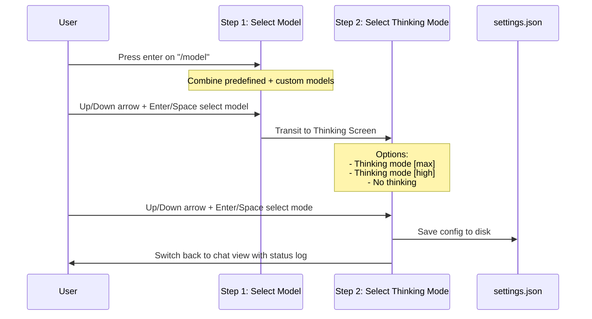

# Specification: Interactive Dropdown Menus & Autocomplete (`/menu`, `skills`, `models`)

> Historical TUI refactor spec: this document uses the removed React/Ink implementation as a comparison baseline. Treat `src/ui/...` references as legacy context only.

This document details the expected interactive behavior, state models, key bindings, and styling for the dropdown menu systems in `anng-cli`, modeled precisely after the TypeScript React + Ink implementations.

---

## 1. Generic Dropdown UI Component (`DropdownMenu`)

In the TypeScript version, [DropdownMenu.tsx](file:///run/media/sanng/New%20Volume/Seminar/Anng_cli/src/ui/components/DropdownMenu/index.tsx) is a reusable visual component. The Go Bubble Tea implementation must implement a similar reusable component structure.

### A. Data Models
```go
type DropdownItem struct {
	Key             string          // Unique identifier
	Label           string          // Display title
	Description     string          // Dimmable details
	Selected        bool            // Checkbox/radio selected state (if applicable)
	StatusIndicator *StatusIndicator // Optional symbol (e.g. checkmark "✓")
}

type StatusIndicator struct {
	Symbol string
	Color  string // HEX color string
}

type DropdownMenuModel struct {
	Title       string
	HelpText    string
	EmptyText   string
	Items       []DropdownItem
	ActiveIndex int
	MaxVisible  int
	Width       int
}
```

### B. Display Rules & Layout Specifications
1. **Border Framing:** Enclosed in a rounded border (`lipgloss.RoundedBorder`).
2. **Title Bar:** Rendered at the top, separated from items by a horizontal border line.
3. **Selection Column Auto-Width:**
   * Compute the maximum content width needed for the labels (including prefix `> ` or `  `, status checkmarks `✓`, and selection bubbles `●` / `○`).
   * Cap this label column width to a maximum of 50% of the total terminal width (`width >> 1`).
4. **Viewport Scrolling & Indicators:**
   * If the number of items exceeds `MaxVisible`, show scrolling indicator lines:
     * Top indicator: `… N above` (dimmed) if items are hidden above.
     * Bottom indicator: `… N more` (dimmed) if items are hidden below.
5. **Item States:**
   * Highlighted row: Colored using the active Brand Color (`#D4704B`) background.
   * Toggle indicators: Checked elements prefix a filled dot `●` (true), unchecked show an empty circle `○` (false).

---

## 2. Slash Command Autocomplete Menu (`/menu`)

When the user types `/` in the input buffer, it matches and filters slash command keywords.

### A. TS Reference
* Core: [slash-commands.ts](file:///run/media/sanng/New%20Volume/Seminar/Anng_cli/src/ui/core/slash-commands.ts)
* View: [SlashCommandMenu.tsx](file:///run/media/sanng/New%20Volume/Seminar/Anng_cli/src/ui/views/SlashCommandMenu.tsx)

### B. Groups & Categories
Slash commands are divided into two distinct groups and displayed with headers:
1. **Built-in Commands (`tui`):** `/settings`, `/skills`, `/model`, `/new`, `/init`, `/resume`, `/continue`, `/undo`, `/mcp`, `/raw`, `/exit`, `/team`, `/team-dp`, `/team-wf`, `/custom-agents`.
2. **Custom & Loaded Skills (`runtime`):** `/writing-plans`, and any skills loaded dynamically from `.agents/skills` or `.anng/skills`.

Whenever a command matches, if it sits at the start of a category group, render a separator row:
```text
  --- Built-in Commands ---
> /skills        List available skills
  /settings      Manage API Key and configurations
```

### C. Visual Layout
* Left column displays the label and optional command arguments (e.g. `/raw lite|normal|raw`).
* Right column displays the command description, truncated to fit the viewport width.

---

## 3. Skills Selection Dropdown (`skills`)

Allows developers to toggle multiple skills context flags before executing a chat query prompt.

### A. TS Reference
* File: [SkillsDropdown/index.tsx](file:///run/media/sanng/New%20Volume/Seminar/Anng_cli/src/ui/components/SkillsDropdown/index.tsx)

### B. State Management & Multi-Select Flow
Unlike a simple auto-complete item selection, the Skills Selection dropdown remains open for checking/unchecking multiple items.

1. **Trigger:** Triggered when the user runs `/skills` (opens list modal) or hits tab while choosing options.
2. **Key Bindings:**
   * `Up Arrow` / `Down Arrow`: Scroll through skills.
   * `Spacebar` or `Enter`: Toggle select/deselect state for the highlighted skill (`selected = !selected`).
   * `Tab` / `Esc`: Confirm selections, close dropdown menu, and return focus to the input buffer.
3. **Visual Cues:**
   * Selected skills are prefixed with `●` and colored text.
   * Skills loaded in memory show a green `✓` checkmark indicator.

### C. Execution Integration
When a user submits a prompt, any active `selectedSkills` are formatted as command tags:
```xml
<user_command slash="skill_name">instructions...</user_command>
```

---

## 4. Models Selection Dropdown (`models`)

Configures active AI models, thinking profiles, and reasoning budgets.

### A. TS Reference
* File: [ModelsDropdown/index.tsx](file:///run/media/sanng/New%20Volume/Seminar/Anng_cli/src/ui/components/ModelsDropdown/index.tsx)

### B. Two-Step Config Wizard
The Model select action is a multi-step sequence rather than a single click:



#### Step 1: Model Selection list
* Predefined list: `deepseek-v4-pro`, `deepseek-v4-flash`, `gemini-3.5-flash`, `gemini-3.1-flash-lite`, `gemini-2.5-flash`, `gemini-2.5-flash-lite`.
* Custom lists: Loaded dynamically from workspace registry `.anng/models.json` or `.anng/settings.json`.
* Select a model to advance to Step 2.

#### Step 2: Thinking Selection options
* Displays three configuration choices:
  1. `Thinking mode [max]` (thinkingEnabled: true, reasoningEffort: max).
  2. `Thinking mode [high]` (thinkingEnabled: true, reasoningEffort: high).
  3. `No thinking` (thinkingEnabled: false).
* Selection triggers settings saving and returns to chat view.
