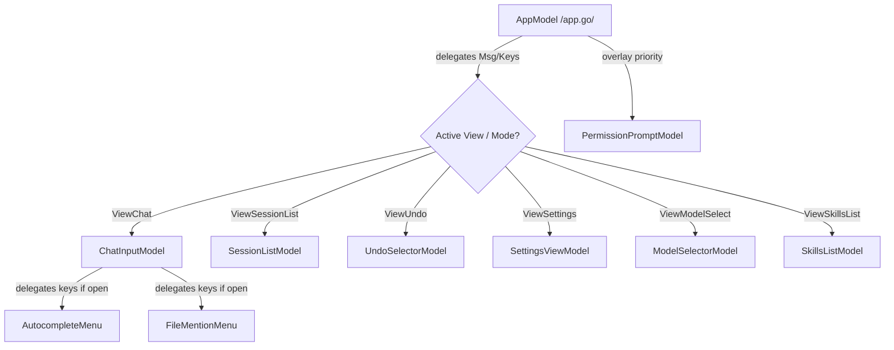

# Architectural Overview: Go TUI Refactoring (anng-cli)

> Historical refactor spec: this document compares the Go TUI against the removed TypeScript UI and proposes a target architecture. References to `src/ui/...`, `.tsx`, or React/Ink are legacy comparison points, not current runtime files.

This document provides a comprehensive analysis of the architectural issues in the current Go TUI implementation of `anng`, compares it to the TypeScript version, and proposes a clean, modular architecture based on Charmbracelet's **Bubble Tea** (Elm Architecture) to fix keyboard handler conflicts, menu misbehaviors, and UI bugs.

---

## 1. Current Issues & Analysis

The current Go TUI implementation attempts to replicate the appearance and behavior of the TypeScript (React + Ink) TUI. However, it suffers from several critical flaws:

### A. Monolithic Key Handling Conflict (Architectural Mismatch)
* **TypeScript TUI:** Uses React's hook-based input model. Component states are isolated, and input focus is scoped to active views (e.g., `SettingsView` captures keyboard input locally; `SlashCommandMenu` intercepts keys, etc.).
* **Current Go TUI (`internal/tui/app.go`):** Uses a monolithic `Update` function. It checks `CurrentView` and handles keys inside huge switch blocks. This leads to key leakage and capture conflicts:
  * For example, arrow keys meant for the Autocomplete slash command menu are also processed or ignored incorrectly, leading to cursor movements in the input buffer or wrong view transitions.
  * Enter key press inside menus (e.g., sessions, model select) can trigger background execution prompts instead of just selecting the item.

### B. Broken Input Buffer Capabilities
* The input buffer doesn't support basic features from the TS version:
  * **Shift+Enter:** For entering newline characters (multi-line editing).
  * **Paste Handling:** Lacks proper chunk parsing or raw bracketed paste escape handling.
  * **Caret Placement & Focus:** Scrolling or adjusting multi-line input viewport width is absent or buggy.
  * **Command History Navigation:** Pressing Up/Down arrows to navigate command history overlaps with menu navigation.

### C. Rigid UI State & View Synchronization
* Views like settings, sessions selection, undo checkpoints, and MCP server lists are written as static template renderers inside `views.go` rather than active stateful components.
* Modals (e.g., Permission Prompt, Ask User Question) lack proper input routing and cannot easily capture keys safely without leaking them back to the chat view.

---

## 2. Target TUI Architecture (Go Bubble Tea Sub-Models)

To solve these problems, we must restructure the Go TUI following Charmbracelet's recommendation: **Nested Sub-Models**.

### Sub-Model Implementation Rules
1. **State Isolation:** Each view or component has its own Bubble Tea `Model` struct containing its internal state (e.g., cursor indices, scroll values, input buffers).
2. **Strict Message Delegation:** The main `AppModel`'s `Update()` function acts purely as a router:
   * It determines the active sub-model or modal.
   * It forwards incoming `tea.Msg` to the active sub-model's `Update()` function.
   * It handles commands/messages returned by the sub-model.
3. **No Key Leakage:** If a sub-model handles a key, the parent model should not intercept it or run fallback logic.
4. **Sub-component Commands:** Sub-models communicate with the parent by returning custom messages (e.g., `SelectSessionMsg`, `CancelViewMsg`, `TriggerSubmitPromptMsg`).

---

## 3. Global Key Map Reference

The table below outlines the keyboard shortcuts that *must* be implemented across the various sub-models to achieve parity with the TS version:

| View / Context | Shortcut | Action |
| :--- | :--- | :--- |
| **Global** | `Ctrl + C` (twice or held) | Force quit CLI application |
| | `Ctrl + D` (on empty input) | Send EOF or Quit |
| **Chat Mode (Input Focused)** | `Enter` | Submit current prompt (expand slash commands & skills) |
| | `Shift + Enter` | Insert newline (multi-line mode) |
| | `Tab` | Accept top autocomplete match or file mention |
| | `Esc` | Clear buffer / Close active dropdown menu |
| | `Ctrl + V` | Read clipboard and attach image reference |
| | `Ctrl + W` / `Meta + Backspace` | Delete word before cursor |
| | `Ctrl + K` | Kill line from cursor to end |
| | `Ctrl + A` / `Home` | Move cursor to start of line |
| | `Ctrl + E` / `End` | Move cursor to end of line |
| | `Ctrl + P` / `Up Arrow` (at start) | History navigation (Previous) |
| | `Ctrl + N` / `Down Arrow` (at end) | History navigation (Next) |
| | `Ctrl + O` | Expand/Collapse paste block or view process stdout |
| | `Ctrl + P` | Toggle Plan Mode (`[plan]`) |
| | `Ctrl + Y` | Toggle Auto-Accept Mode (`[auto]`) |
| **Dropdown Menu Open** | `Up Arrow` / `Down Arrow` | Move selection highlight up/down |
| | `Enter` / `Tab` | Choose and apply the highlighted match |
| | `Esc` | Close dropdown menu and return to typing |
| **Sub-Views (Sessions, Undo, MCP)** | `Up Arrow` / `Down Arrow` | Move list cursor |
| | `Enter` | Select/Apply item and return to chat view |
| | `Esc` | Cancel and return to chat view |
| | `d` (Session List only) | Delete selected chat session |
| **Permission Prompts** | `Up Arrow` / `Down Arrow` | Select prompt choice (Allow / Always Allow / Deny) |
| | `Enter` | Confirm selection |
| | `Esc` | Deny permission |

---

## 4. Synthesis & Refactoring Steps

To refactor the Go TUI systematically:
1. **Phase 1: Specs Generation** - Document specifications for each file, [dropdown menus systems](file:///run/media/sanng/New%20Volume/Seminar/Anng_cli/docs/superpowers/specs/tui-refactor/dropdown_menus.md), and [settings & provider management](file:///run/media/sanng/New%20Volume/Seminar/Anng_cli/docs/superpowers/specs/tui-refactor/settings_providers.md) (completed in this task).
2. **Phase 2: Input Buffer Separation** - Refactor `input_buffer.go` into a state-tracking module supporting cursor navigation across multiple lines, insertion, deletion, and history.
3. **Phase 3: Dropdown Menus Refactoring** - Extract `autocomplete.go`, `file_mentions.go`, and dropdown menus into standalone bubble sub-models with independent focus logic.
4. **Phase 4: Views Modulization** - Convert templates inside `views.go` into Bubble Tea models (`SessionList`, `UndoSelector`, `ModelSelector`, `SettingsView`).
5. **Phase 5: Central Dispatch Redesign** - Rewrite `app.go` as a lightweight state router delegating to sub-models.
6. **Phase 6: Verification & Testing** - Write unit and integration tests for each model.

