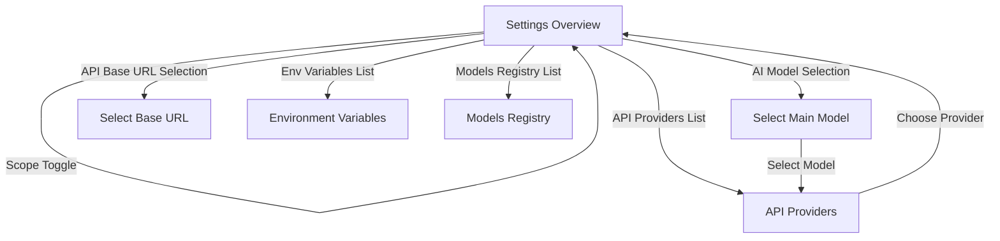

# Specification: Settings Console & API Provider Management (`/settings`)

> Historical TUI refactor spec: this document compares the Go settings flow with the removed TypeScript UI and may cite legacy `src/ui/...` files.

This document details the layout, data management, scopes, screen flows, and interactive behavior for the settings and provider management console in `anng-cli`, matching the TypeScript version's `SettingsView` architecture.

---

## 1. Context & Architecture

### A. Current Go TUI Settings Limitations
* **Static Output:** The Go settings screen (`renderSettings` in `app.go`) is a simple read-only print panel displaying version details and plan mode parameters.
* **No Modifiability:** It is impossible to configure API Keys, edit active models, toggle global/project scopes, register custom base URLs, manage environment variables, or save configured API providers to disk.

### B. TS Settings View Structure
In the TS version, [SettingsView.tsx](file:///run/media/sanng/New%20Volume/Seminar/Anng_cli/src/ui/views/SettingsView.tsx) acts as a complete settings console. It provides:
1. **Interactive navigation** across multiple sub-menus.
2. **Persistence synchronization** (writing updates immediately to local/project config files).
3. **Cursor state preservation** (keeping the active scrolling row index for each submenu screen when switching back and forth).

---

## 2. Navigation Screens

The settings console is structured as a hierarchical state machine with the following screens:

### A. Settings Overview (`main`)
Lists primary configurations with active values and brief helpful instructions:
1. **Settings Scope:** Press Enter to toggle between `Project-Specific` (local workspace `.anng/settings.json`) and `Global` (user home directory `~/.anng/settings.json`).
2. **AI Model:** Shows current configured model name. Press Enter to select/change.
3. **API Base URL:** Displays current active endpoint URL.
4. **Environment Variables:** Number of custom API keys or values configured in this scope.
5. **Thinking Mode:** Toggle LLM thinking/reasoning capability.
6. **Reasoning Effort:** Switch budget limit (e.g. `max` vs `high`).
7. **Providers:** Displays number of configured API providers.
8. **Models Registry:** Manage registered LLMs.

### B. Select Main Model (`models`)
* Renders a list of predefined models combined with names registered in the **Models Registry**.
* Items include a indicator bubble `●` if active.
* Includes special triggers:
  * `+ Add Custom Model...`: Prompt text entry to append a new custom model to the active setting.
  * `✖ Clear Model Setting`: Clear model selection from this settings scope.
* **Select Model Flow:** When a model is chosen, transition to the `Providers` screen to configure/associate it with a specific provider key and URL.

### C. Select Base URL (`baseUrls`)
* Offers predefined options for popular providers:
  * **DeepSeek:** `https://api.deepseek.com`
  * **OpenAI:** `https://api.openai.com/v1`
  * **Groq:** `https://api.groq.com/openai/v1`
  * **OpenRouter:** `https://openrouter.ai/api/v1`
  * **Gemini:** `https://generativelanguage.googleapis.com/v1beta/openai/`
* Includes `+ Add Custom Base URL...` and `✖ Clear Base URL Setting` items.

### D. Environment Variables (`envVars`)
* Displays sorted keys and values from the `env` config map.
* **Security Masking:** If a key contains strings like `key`, `token`, or `secret`, obscure its value using `***`.
* Key Bindings:
  * `Delete` / `d`: Remove selected environment variable from scope.
  * `+ Add New Environment Variable...`: Prompt input using key-value pair parser (`KEY=VALUE`). If no `=` is provided, validate key name format and default value configuration.

### E. API Providers (`providers`)
* Lists configured API providers by `ID` and `Name`, showing masked credentials and base URLs.
* Select a provider to apply its `API_KEY` and `BASE_URL` to the model config settings.
* Key Bindings:
  * `Delete` / `d`: Remove provider configuration.
  * `+ Add Provider`: Activates a 4-step input prompt wizard:
    1. **Input ID:** Choose a key shorthand (e.g., `deepseek`).
    2. **Input Name:** Label description (e.g., `DeepSeek API Pro`).
    3. **Input API Key:** Raw credential token.
    4. **Input Base URL:** Destination API endpoint.

### F. Models Registry (`modelRegistry`)
* Manages registration mappings.
* Shows tested validation statuses: `✅ tested` / `❌ untested`.
* Key Bindings:
  * `Delete` / `d`: Unregister model.
  * `t`: Run a test request in the background. Connects to the associated provider API to query a short token completion (`"Respond with just the word OK"`). If successful, flips status to `tested: true` and logs positive validation.
  * `+ Add Model`: Register a brand new model name string.

---

## 3. Persistent Scope Operations
Changes made within the configuration screens must write to disk immediately:
* **Global Configuration:** Saved to `~/.anng/settings.json`.
* **Project Configuration:** Saved to `<project_root>/.anng/settings.json`.
* **Registry Caches:** Custom models and providers list must synchronize with `.anng/models.json` and `.anng/providers.json`.
